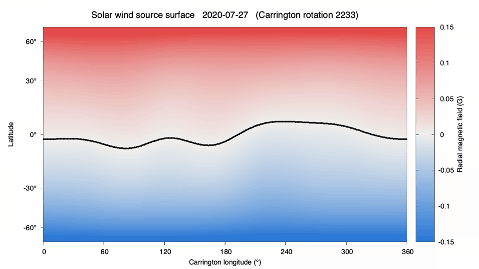
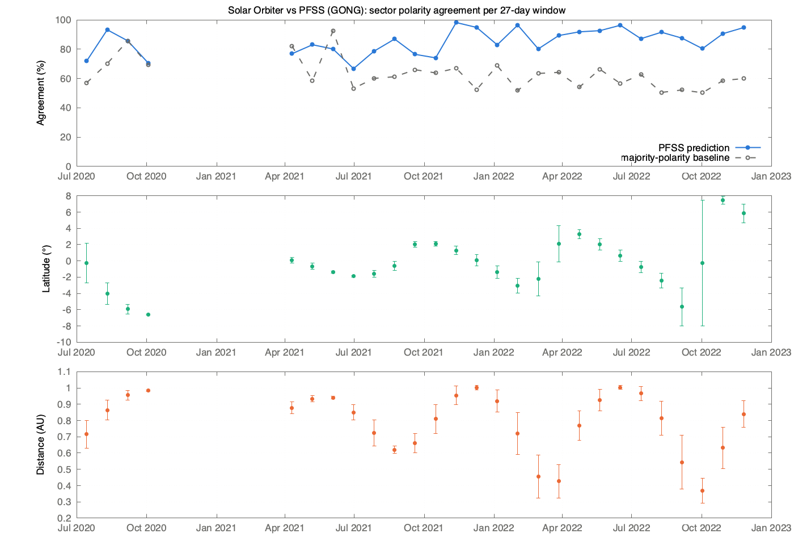

# magneto-sun

[](https://github.com/Pleym/magneto-sun/actions/workflows/ci.yml)

magneto-sun predicts the magnetic polarity of the solar wind reaching Solar Orbiter from
maps of the Sun's surface magnetic field, and compares the prediction with the spacecraft
measurements. The processing chain is written in Fortran (numerical kernels) and C++
(data handling), and is organised like a small mission ground segment, from raw data to
scored science products.



*Magnetic field at 2.5 solar radii, one map per 27-day window from July 2020 to December
2022. Red: field pointing away from the Sun; blue: toward the Sun; black: the current
sheet between them. Video version: [figures/replay.mp4](figures/replay.mp4).*

## Method

1. **Surface field.** A GONG synoptic magnetogram gives the radial magnetic field over
   the whole solar surface.
2. **Spherical harmonics.** The map is expanded in spherical harmonics by least squares,
   stabilised by Tikhonov regularisation with the L-curve criterion.
3. **Coronal field.** A potential-field source-surface (PFSS) model extends the field up
   to 2.5 solar radii. The line where the field changes sign there is the base of the
   heliospheric current sheet.
4. **In situ polarity.** Solar Orbiter's magnetic field gives the measured polarity, along
   the Parker spiral. Each hour of solar wind is traced back to the source surface with
   the measured wind speed (ballistic mapping).
5. **Score.** For each 27-day window, the score is the fraction of hours where predicted
   and measured polarities agree. It is compared with a baseline that always predicts the
   majority polarity.

## Data

| Data | Provider | Access |
|---|---|---|
| GONG hourly synoptic magnetograms (zero-point corrected) | National Solar Observatory | [gong2.nso.edu/oQR/zqs](https://gong2.nso.edu/oQR/zqs/) |
| SDO/HMI synoptic magnetograms (performance tests) | JSOC, Stanford | [jsoc.stanford.edu/data/hmi/synoptic](http://jsoc.stanford.edu/data/hmi/synoptic/) |
| Solar Orbiter MAG, magnetic field (L2, RTN, 1 min) | AMDA, CDPP (from the [ESA Solar Orbiter Archive](https://soar.esac.esa.int/)) | [amda.irap.omp.eu](https://amda.irap.omp.eu/) |
| Solar Orbiter SWA-PAS, solar wind speed | AMDA, CDPP | [amda.irap.omp.eu](https://amda.irap.omp.eu/) |
| Solar Orbiter position in Carrington coordinates | JPL Horizons | [ssd.jpl.nasa.gov/horizons](https://ssd.jpl.nasa.gov/horizons/) |

The campaign covers 33 windows of 27 days, from 14 July 2020 to 22 December 2022
([config/campaign_solo_2020_2022.txt](config/campaign_solo_2020_2022.txt)). All inputs
are downloaded by the scripts in [scripts/](scripts/).

## Results

- **Polarity.** Over the 27 windows with complete data, the predicted polarity matches the
  measurement **85 % of the time** on average, against 63 % for the majority-polarity
  baseline. The model beats the baseline in 24 windows out of 27.
- **Missing data.** The 6 windows between November 2020 and April 2021 have no solar wind
  speed measurement. They are flagged as insufficient data rather than scored.
- **Validation.** The PFSS model agrees with the independent solver
  [sunkit-magex](https://github.com/sunpy/sunkit-magex) on 99.9 % of the source surface.
- **Performance.** An exact block decomposition of the spherical-harmonic fit gives the
  same solution about 6,000 times faster than the direct least-squares solver. A full
  SDO/HMI map (5.1 million pixels, 520,000 unknowns) is fitted in 10 seconds on a laptop.



## Processing chain

- **Levels.** L1 raw inputs, L2 standardised hourly in situ series, L3 science products
  (spherical-harmonic fit, PFSS map, polarity score), L4 campaign summary.
- **Traceability.** Each product has a `.meta.json` record with the code version, the
  parameters and the checksums of the program and of every input.
- **Automation.** GNU Make runs the campaign: only outdated products are recomputed, steps
  run in parallel, and a failing window does not stop the others. Downloads are kept
  separate from computing, so the chain can run on cluster nodes without network access.
- **Testing.** Every algorithm is tested on synthetic data with a known answer. Build and
  tests run on every push (GitHub Actions).
- **Performance.** OpenMP parallelism and a benchmark kit for the ROMEO supercomputer.

Details: [docs/operations.md](docs/operations.md).

## Usage

Requirements: CMake, Fortran and C++ compilers, cfitsio, LAPACK, gnuplot, and ffmpeg for
the animation.

```bash
make build            # compile and run the tests
make fetch            # download the inputs of the 33 windows (~100 MB)
make -j4 -k campaign  # process every window and build the campaign summary
make replay           # regenerate the animation
```

## Acknowledgements

Data analysis used the AMDA science analysis system provided by the Centre de Données de
la Physique des Plasmas (CDPP). Solar Orbiter is a mission of international cooperation
between ESA and NASA; MAG and SWA data are provided by their instrument teams. GONG data
are provided by the National Solar Observatory, HMI data by the SDO/HMI team, and
spacecraft ephemerides by the JPL Solar System Dynamics group.
